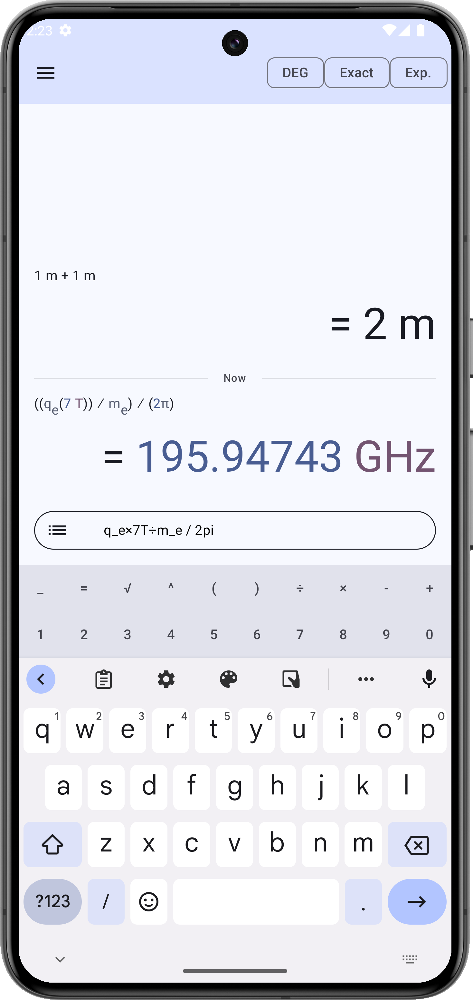

 
<h1 align="center">
  Qalculate! for android
</h1>
<!-- description -->

  <strong>~ Powerful and versatile multi-purpose calculator for the Android platform ~</strong>
   
  :warning: <i>This project is in very early development state</i>
  This is a fork of the original project at https://github.com/jherkenhoff/qalculate-android

Android UI of the almighty <a href="https://qalculate.github.io">Qalculate!</a> calculator. It is simple to use but provides power and versatility normally reserved for complicated math packages, as well as useful tools for everyday needs (such as currency conversion and percent calculation). Features include a large library of customizable functions, unit calculations and conversion, symbolic calculations (including integrals and equations), arbitrary precision, uncertainty propagation, interval arithmetic, plotting, and a user-friendly interface.

 
 

  

## Features
Features specific to qalculate-android:

* Platform-Native Graphical user interface
* Simple default view
* Optional calculate-as-you-type mode

Features added by this fork:

* History persistence
* Pure material UI
* Calculate-as-you-type mode

Features from libqalculate:

* Calculation and parsing:
* Result display:
* Symbolic calculation:
* Functions:
* Units:
* Variables and constants:
* Plotting:
* and more...

_For more details about the syntax, and available functions, units, and variables, please consult the manual (https://qalculate.github.io/manual/)_